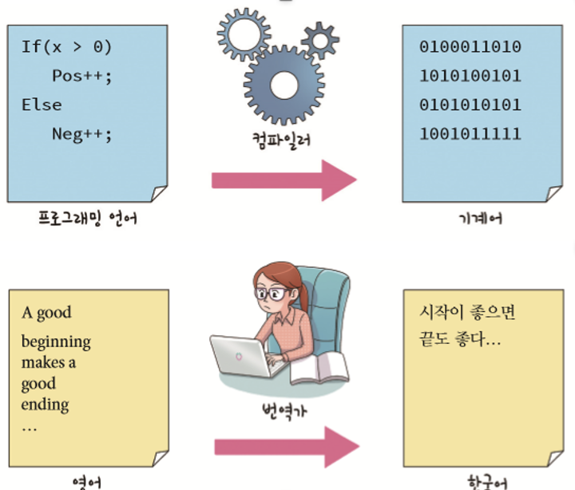
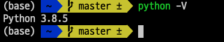
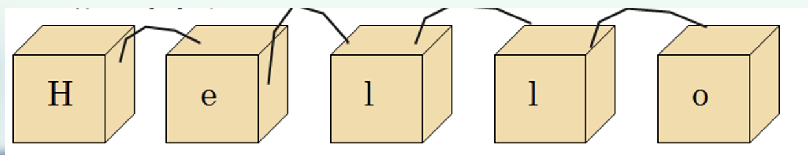
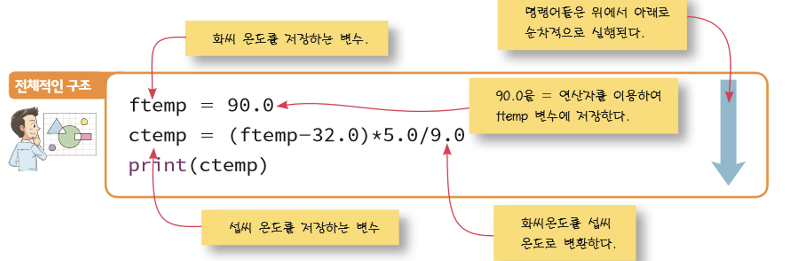
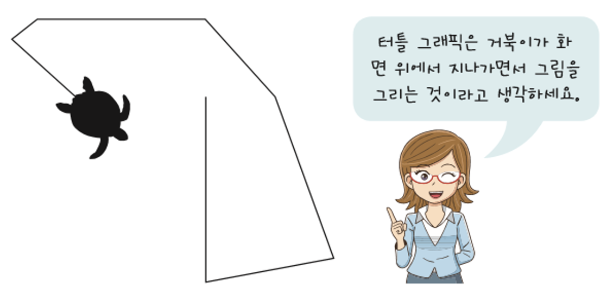
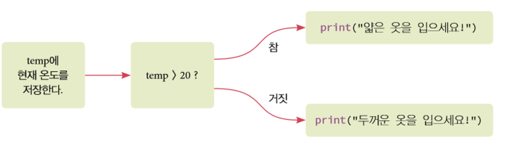
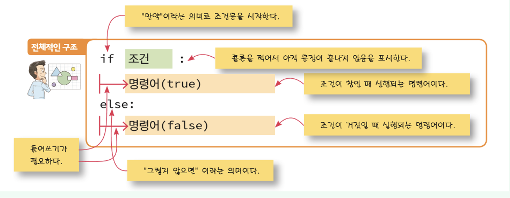
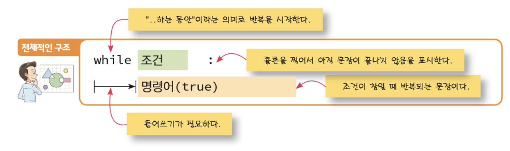

# 파이썬 소개

## 컴퓨터 프로그램의 특징

- 우리는 일상생활에서 컴퓨터를 많이 사용한다.
- 컴퓨터의 최대 장점: 반복적인 작업을 잘한다.
- 컴퓨터의 핵심: 범용성
  - (예)스마트폰: 우리는 스마트폰에 다양한 기능을 하는 앱(프로그램)을 설치하여 여러가지 작업을 할 수 있다.
- 컴퓨터에 일을 시키려면 인간이 컴퓨터에게 자세한 명령어(instruction)들을 주어야 한다.
- 프로그램 (program) : 컴퓨터가 수행할 명령어를 적어 놓은 문서
- 프로그램은 컴퓨터에만 설치되는 것이 아니다.
- 임베디드 프로그램(embedded program): 전자기기에 내장되는 프로그램
- 컴퓨터는 사람의 언어를 이해할 수 없다!
- 기계어 (machine language) : 컴퓨터가 알아듣는 유일한 언어
- 기계어는 0과 1로 구성된다.
- 초기의 컴퓨터에서는 기계어를 사용하여 프로그램을 했었다.
  - C 언어를 기준으로 그보다 낮은 언어를 저급언어라고 하며, 그보다 상위언어를 고급언어라고 한다.
- 인간의 언어에 근접한 프로그래밍 언어가 개발된다.
  - 인간이 프로그래밍 언어를 배워서 프로그램을 작성하면 컴파일러(compiler)라고 하는 통역을 담당하는 소프트웨어가 프로그램을 기계어로 번역한다.



## 파이썬이란?

- 1991년에 귀도 반 로섬(Guido van Rossum)이 개발한 대화형 프로그래밍 언어이다.
- 생산성이 뛰어나다.
- 초보자한테 좋은 언어 – 인터프리터 언어(해석기)
- 파이썬은 실행 전에 컴파일 할 필요가 없다.(타 언어들은 실행하기 전에 컴퓨터가 이해할 수 있는 기계어로 컴파일 하는 과정이 필요하다.)
- 파이썬은 문법이 쉬워서 코드를 보면 직관적으로 알 수 있는 부분이 많다.

```python
if "사과" in ["딸기", "바나나", "포도", "사과"]:
	print("사과가 있습니다")
```

- 파이썬은 다양한 플랫폼에서 사용한다.
- 라이브러리가 풍부하다.
- 애니메이션이나 그래픽을 쉽게 사용할 수 있다.

## 파이썬 설치하기

- 설치 경로: https://www.python.org/downloads/
- 설치 완료 후 확인법



## 파이썬 프로그램 분석하기

- 파이썬 프로그램은 여러 줄의 명령어로 이루어진다. 한 줄의 명령어를 문장(statement) 이라고 부른다.
- 문장들은 파이썬 인터프리터에 의하여 순차적으로 실행된다.
- print() 함수는 문자열을 화면에 출력한다.
- 문자열은 쌍따옴표로 둘러싸인 문자들의 모임이다. 텍스트 데이터를 나타낸다.

## 문자열, print() 함수

- 문자열 (string): 큰따옴표("...")나 작은따옴표('...') 안에 들어 있는 텍스트 데이터들을 의미한다.



- 반드시 따옴표가 있어야 한다.

```shell
>>> print(Hello World!)
	SyntaxError: invalid syntax
```

- print()함수 : 여러 개의 값들을 화면에 차례대로 출력할 수 있다.

```shell
>>> print("결과값은", 2*7, "입니다.")
결과값은 14 입니다.
```

## 스크립트 모드

- 명령어를 한 줄씩 입력하여 실행하는 것은 초보 프로그래머한테 아주 편리한 기능이다.(이것이 인터프리트 모드라고 한다.)한 줄의 명령어를 입력하여 실행하고 결과를 즉시 알 수 있으며 현재 상태를 언제든 파악 가능하다.
- 하지만 코드가 복잡해지면 인터프리트 모드는 아주 번거롭다.

## 소스 파일 작성하기

- 텍스트 에디터를 이용하여 명령어들을 파일에 저장한 후에 파일을 읽어서 명령어들을 하나씩 실행하는 방법이 있다. 명령어들이 저장된 파일을 소스 파일(source file)이라고 한다.

## 간단한 프로그램의 분석



## 변수

- 변수는 컴퓨터의 메모리 안에 만들어지는 공간으로 우리는 여기에 숫자나 문자를 저장할 수 있다.
- 변수에 값을 저장할 때

```python
ftemp = 90.0
```

## 터틀 그래픽

- 카테시안 공간에서 커서(터틀)를 이용하여서 그림을 그리는 기능을 말한다.



## 터틀 그래픽 윈도우

- 터틀 그래픽 윈도우는 아래와 같이 실행하여 그림을 그린다.

## 조건문과 반복문의 간단한 소개

- 예를 들면 날씨에 따라서 옷을 선택해주는 프로그램



- 조건문의 구조



- 조건문 예제 코드

```python
temp = 10
if temp > 20 :
	print("얇은 옷을 입으세요!")
else:
	print("두꺼운 옷을 입으세요!")
```

- 반복문의 소개



- 반복문 코드

```python
sign = "stop"

while sign == "stop":
	sign = input("현재 신호를 입력하시오: ")
print("OK! 진행합니다.")
```

```shell
현재 신호를 입력하시오: stop
현재 신호를 입력하시오: stop
현재 신호를 입력하시오: stop
현재 신호를 입력하시오: stop
현재 신호를 입력하시오: stop
현재 신호를 입력하시오: go
OK! 진행합니다.
```

## 핵심정리

- 프로그램은 명령어들로 이루어진 텍스트 파일 형태로 작성된다. 이것을 소스파일 이라고 한다.
- 파이썬 인터프리터는 소스 파일을 해석하여서 컴퓨터가 이해할 수 있는 기계어 파일로 변환하여 생성한다.
- 문장들은 기본적으로 순차적으로 실행되지만 조건에 따라서 서로 다른 경로로 실행되거나 반복될 수 있다.
